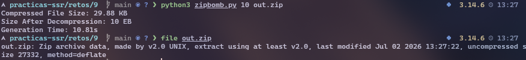

# RETO 9: Malware
Para este reto se ha decidido explorar los programas 'bomba' de distintos formatos. Este tipo de ficheros son utilizados principalmente para la denegación de servicio, debido a que al descomprimirse o usarse en un proceso de software, ocupan un gran espacio de memoria y tienden a saturar el sistema en el que se ejecuten y procesen.

## Zip-Bomb
Una zip-bomb es generalmente un fichero comprimido con datos inútiles, comprimido de manera recursiva para que desde un fichero minúsculo, al descomprimir, se llene el espacio de memoria, y así poder saturar un equipo. Para hacer una zip-bomb se pueden utilizar diferentes metodologías. Una de ellas, es utilizando bibliotecas de Python de compresión zip, las cuales nos facilitarán realizar esta tarea. En la carpeta `zipbomb`, se puede encontrar el código que genera una zip bomb de tamaño descomprimido de 10 Exabytes.

El script genera un fichero dummy de 1GB de '0', y lo comprime en un primer fichero .zip, borrando después el fichero de texto. A cada iteración, coge 10 copias del fichero .zip del nivel de compresión anterior, y las introduce en el nivel actual. Para conseguir el tamaño de aproximadamente 10 Exabytes, deberemos hacer este bucle de compresión 10 veces. 

Ejecutando `python zipbomb.py 10 out.zip`, obtendremos un fichero que a primera instancia parece inofensivo, de unos 30KB de tamaño aproximadamente:



Sin embargo, diése el caso de que un servidor procesase este fichero, al descomprimirlo recursivamente, se llenaría su espacio en disco, pudiendo inutilizar el servicio hasta reiniciarlo.

## YAML-Bomb

Otro formato similar para este tipo de ataques es mediante el formato de configuración `.yaml`. Este tipo de ataque se dirige a servidores web, y tiene el mismo objetivo que una zipbomb.

En el siguiente bloque de código, podemos ver un sencillo fichero de 15 líneas .yaml, que al desempaquetar ocuparía teóricamente 7.62 Petabytes:

```
a: &a [_,_,_,_,_,_,_,_,_,_,_,_,_,_,_]
b: &b [*a,*a,*a,*a,*a,*a,*a,*a,*a,*a]
c: &c [*b,*b,*b,*b,*b,*b,*b,*b,*b,*b]
d: &d [*c,*c,*c,*c,*c,*c,*c,*c,*c,*c]
e: &e [*d,*d,*d,*d,*d,*d,*d,*d,*d,*d]
f: &f [*e,*e,*e,*e,*e,*e,*e,*e,*e,*e]
g: &g [*f,*f,*f,*f,*f,*f,*f,*f,*f,*f]
h: &h [*g,*g,*g,*g,*g,*g,*g,*g,*g,*g]
i: &i [*h,*h,*h,*h,*h,*h,*h,*h,*h,*h]
j: &j [*i,*i,*i,*i,*i,*i,*i,*i,*i,*i]
k: &k [*j,*j,*j,*j,*j,*j,*j,*j,*j,*j]
l: &l [*k,*k,*k,*k,*k,*k,*k,*k,*k,*k]
m: &m [*l,*l,*l,*l,*l,*l,*l,*l,*l,*l]
n: &n [*m,*m,*m,*m,*m,*m,*m,*m,*m,*m]
o: &o [*n,*n,*n,*n,*n,*n,*n,*n,*n,*n]
```
Además existen paquetes vulnerables a este ataque como,  Python YAML, o NodeJS Yaml, que parsearían el contenido de este archivo hasta crashear. Esta bomba en específico utiliza las variables del formato YAML para autoreferenciar y autodeclarar los mismos arrays unas 15 veces, 10 veces por línea.
